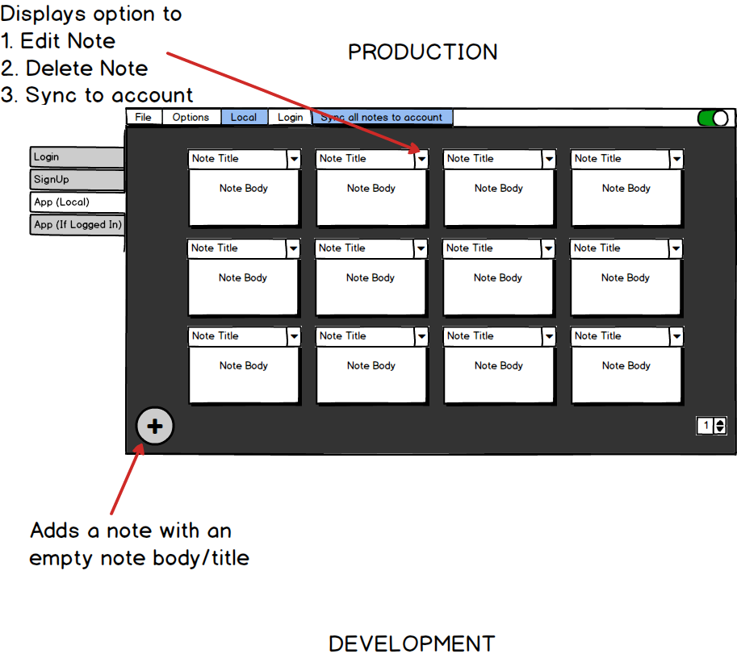

# Description
Desktop Note Application User story and mockup display. Created for fun

# Quick Links

Scroll Down for pretty pictures!

[User Stories](https://raw.githubusercontent.com/s1iqbal/mockUps/master/UserStories.png)

[Database Design Display](databaseSchemaUser.png)

[Login Module](loginModule.png)

[Sign Up Module](signupModule.png)

# User Stories

# Stack Information

**Stack Description**: MEER

**Datastore**: mongoDb

**Frontend**: React & Electron

**Backend**: Express & Vanilla JS

**Runtime**: Node

# Database Schema
(Will seperate data and user module into seperate schema)

# Login Module

# Signup Module

# Local Note Module

