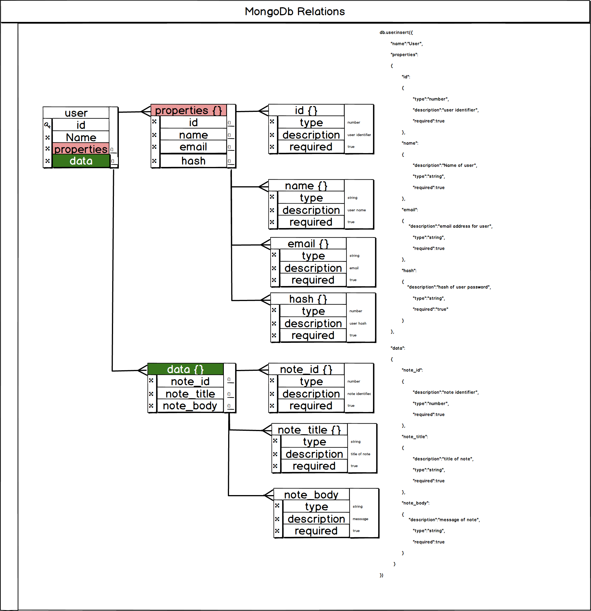
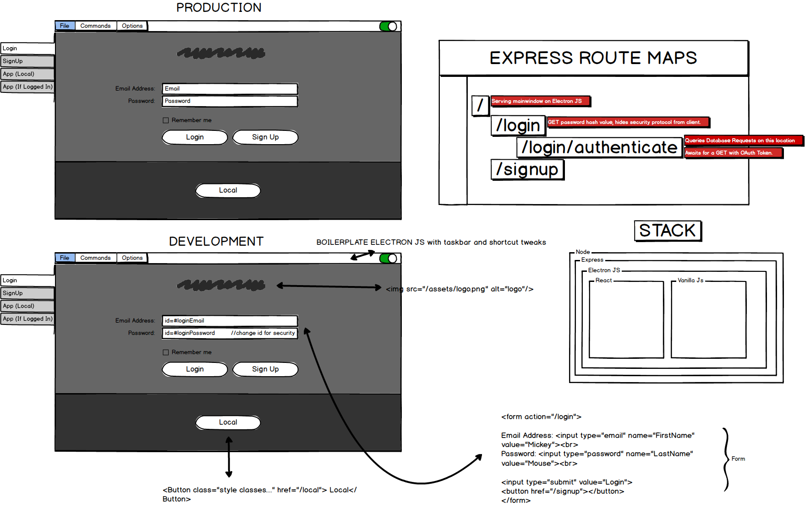

# Description
Desktop Note Application User story and mockup display. Created for fun

# Quick Links

Scroll Down for pretty pictures!

[User Stories](https://github.com/user/repo/blob/branch/other_file.md)

[Database Design Display](https://raw.githubusercontent.com/s1iqbal/mockUps/master/databaseSchemaUser.png)

[Login Module](https://raw.githubusercontent.com/s1iqbal/mockUps/master/loginModule.png)

[Sign Up Module](https://raw.githubusercontent.com/s1iqbal/mockUps/master/signupModule.png)

# User Stories

# Stack Information

**Stack Description**: MEER

**Datastore**: mongoDb

**Frontend**: React & Electron

**Backend**: Express & Vanilla JS

**Runtime**: Node

# Database Schema

# Login Module

# Signup Module

